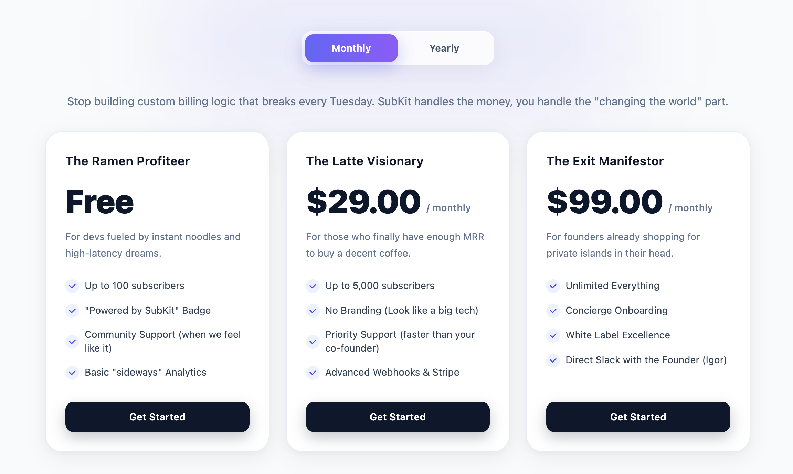

# SubKit

Laravel subscriptions with a ready-to-use Filament UI.  
Replace days of custom billing logic with a working setup on top of Stripe (Cashier).

- Skip custom subscription logic
- Skip building pricing UI
- Skip wiring Stripe webhooks manually

[](art/screen-subkit-theme-default.png)


SubKit provides a Filament admin panel to manage plans and plan sets, themeable Blade components for your pricing page and subscription dashboard, and a clean PHP API for subscription lifecycle operations.

**Why use SubKit?**
While Laravel Cashier is incredibly powerful, building the actual UI and admin panel for subscriptions takes days. SubKit bridges this gap by providing a **"Lickable UI"** out of the box and a powerful Filament admin to manage it all without writing boilerplate code.

## What it does

- Integrates with Stripe via Laravel Cashier (webhooks, checkout sessions, billing portal)
- Provides a Filament admin panel to manage Plans, Plan Sets, and Provider Prices
- Provides Blade components: a pricing table and a subscription management UI, with multiple themes
- Exposes a PHP facade and REST API for subscription operations (checkout, cancel, resume, billing portal)

## What it does NOT do

- Process payments or store card data
- Replace Stripe or Laravel Cashier — it orchestrates on top of them
- Handle invoicing, taxes, or compliance
- Manage user authentication or access control

---

## Requirements

- PHP 8.4+
- Laravel 11+
- Laravel Cashier (`laravel/cashier` ^16.5) installed and configured
- Filament (`filament/filament` ^3.2)
- MySQL 8+ (or MariaDB 10.5+)
- A Stripe account

---

## Installation

```bash
composer require karpovigorok/subkit
```

Publish the config and run migrations:

```bash
php artisan vendor:publish --tag=subkit-config
php artisan vendor:publish --tag=subkit-migrations
php artisan migrate
```

Register the plugin in your Filament panel provider:

```php
use SubKit\Filament\SubKitPlugin;

public function panel(Panel $panel): Panel
{
    return $panel
        // ...
        ->plugin(SubKitPlugin::make());
}
```

---

## Configuration

```bash
php artisan vendor:publish --tag=subkit-config
```

Add to your `.env`:

```env
STRIPE_KEY=pk_live_...
STRIPE_SECRET=sk_live_...
STRIPE_WEBHOOK_SECRET=whsec_...

# Optional
EASY_SUB_CURRENCY_CODE=USD
EASY_SUB_CURRENCY_SYMBOL=$
```

Your `User` model must use Cashier's `Billable` trait:

```php
use Laravel\Cashier\Billable;

class User extends Authenticatable
{
    use Billable;
}
```

---

## Stripe setup

### 1. Create plans in the admin panel

Navigate to your Filament admin panel (usually `/admin`) → **Plans** → Create a plan. After creating a plan, add a Stripe Price ID in the **Provider Prices** tab on the plan edit page.

### 2. Register the Stripe webhook

Point your Stripe webhook to Cashier's built-in route:

```
https://your-app.com/stripe/webhook
```

Events to enable in Stripe:
- `customer.subscription.created`
- `customer.subscription.updated`
- `customer.subscription.deleted`
- `invoice.paid`
- `invoice.payment_failed`

---

## Usage

### Pricing table

Drop the pricing table into any Blade view. The component uses the currently authenticated user automatically — no user ID needed.

```blade
<x-subkit::pricing-table
    provider="stripe"
    success-url="{{ route('dashboard') }}"
    cancel-url="{{ route('pricing') }}"
/>
```

With a plan set (for multiple landing pages or A/B testing):

```blade
<x-subkit::pricing-table
    set="homepage_2024"
    provider="stripe"
    success-url="{{ route('dashboard') }}"
    cancel-url="{{ route('pricing') }}"
/>
```

#### All pricing table props

| Prop | Type | Default | Description |
|------|------|---------|-------------|
| `set` | `string\|null` | `null` | Plan set code. If omitted, shows all active plans. |
| `theme` | `string\|null` | `'default'` | UI theme (`default`, `dark`, `modern`, or a custom theme). |
| `provider` | `string` | `'stripe'` | Payment provider. |
| `success-url` | `string` | `''` | Redirect after successful checkout. Accepts a route name, relative path, or full URL. |
| `cancel-url` | `string` | `''` | Redirect when the user cancels checkout. |
| `free-url` | `string` | `''` | CTA destination for $0 plans (authenticated users). |
| `guest-redirect-url` | `string\|null` | `null` | Where unauthenticated visitors are sent. Defaults to `/register`. |
| `company-id` | `string\|null` | `null` | For B2B: attaches the subscription to a company rather than a user. |
| `subscribe-label` | `string\|null` | `null` | Override the "Get Started" button text. |
| `free-label` | `string\|null` | `null` | Override the "Get Started Free" button text. |
| `guest-label` | `string\|null` | `null` | Override the "Create Account to Subscribe" button text. |

URL props accept a **route name** (e.g. `'dashboard'`), a **relative path** (e.g. `'/thanks?utm_source=fb'`), or a **full URL**. Route names are resolved automatically. URLs set in the admin panel (per Plan Set) serve as defaults when the prop is omitted.

For the best UX, point **Free Plan URL** to a route that automatically creates a $0 subscription for the authenticated user.

Button labels follow a three-tier fallback: **Blade prop → Plan Set admin setting → translation string**.

### Manage subscriptions

Drop the manage component into your dashboard or account page:

```blade
<x-subkit::manage-subscriptions
    return-url="{{ route('dashboard') }}"
/>
```

This renders the user's active subscriptions: plan name, status badge, trial/renewal dates, and action buttons (Cancel, Resume, Manage Billing). Renders nothing if the user has no subscriptions.

#### All manage-subscriptions props

| Prop | Type | Default | Description |
|------|------|---------|-------------|
| `theme` | `string\|null` | `'default'` | UI theme. |
| `return-url` | `string` | `''` | URL to return to from the Stripe billing portal. |
| `guest-redirect-url` | `string\|null` | `null` | Where guests are sent. Renders a redirect link instead of the subscription UI. |

### Check subscription access

```php
use SubKit\Facades\SubKit;

if (SubKit::hasAccess((string) auth()->id())) {
    // User has an active or trialing subscription
}
```

`hasAccess()` returns `true` for `active` and `trialing` states.

### Get subscriptions for a user

```php
$subscriptions = SubKit::forUser((string) auth()->id());

$active = SubKit::activeForUser((string) auth()->id()); // returns Cashier Subscription or null
```

### Cancel a subscription

```php
// Cancel at period end (access continues until the billing period ends)
SubKit::cancel($subscriptionId);

// Cancel immediately
SubKit::cancel($subscriptionId, immediately: true);
```

### Resume a subscription

```php
SubKit::resume($subscriptionId);
```

### Billing portal

Redirect the user to the Stripe-hosted billing portal to manage payment methods and invoices:

```php
$url = SubKit::billingPortal($subscriptionId, route('dashboard'));
return redirect()->away($url);
```

---

## Plan Sets

Plan Sets let you curate groups of plans for specific contexts — landing pages, A/B tests, regional pricing, etc.

Create a plan set in the admin panel under **Plan Sets**, assign plans to it, and reference it by code:

```blade
<x-subkit::pricing-table set="startup_annual" />
```

Per Plan Set you can configure:
- **Theme** — override the default UI theme
- **Description** — subtitle shown above the pricing table
- **URLs** — default success, cancel, free, and guest redirect URLs
- **Button Labels** — override button text per set

---

## Plan Features

SubKit includes a normalized, Many-to-Many feature management system.
Instead of hardcoding features in your Blade files, you can manage a global library of features (e.g., "Priority Support", "Unlimited Projects") directly in the Filament admin panel.

Simply attach features to your Plans using the intuitive Filament interface, and SubKit's pricing tables will automatically render them with beautiful checkmarks inside the pricing cards.

---

## B2B usage

For company-level subscriptions, pass `company-id`:

```blade
<x-subkit::pricing-table
    :company-id="(string) $company->id"
    provider="stripe"
    success-url="{{ route('dashboard') }}"
    cancel-url="{{ route('pricing') }}"
/>
```

`company-id` is a plain string with no foreign key constraint — it can reference any table in your app (`teams`, `organizations`, `workspaces`, etc.).

---

## Themes

Three themes are bundled: `default`, `dark`, and `light`. Specify the theme per component or per Plan Set.

To create a custom theme, publish the views and add a new folder:

```bash
php artisan vendor:publish --tag=subkit-views
```

Create `resources/views/vendor/subkit/themes/{your-theme}/pricing-table.blade.php`. The theme will appear automatically in the admin panel's theme selector.

---

## REST API

| Method | URL | Description |
|--------|-----|-------------|
| `POST` | `/api/subkit/checkout` | Create a Stripe Checkout session |
| `GET`  | `/api/subkit/subscriptions/user` | List subscriptions for the authenticated user |
| `GET`  | `/api/subkit/subscriptions/company` | List subscriptions for a company |
| `POST` | `/api/subkit/subscriptions/{id}/cancel` | Cancel a subscription |
| `POST` | `/api/subkit/subscriptions/{id}/resume` | Resume a subscription |

Add authentication middleware in `config/subkit.php`:

```php
'api' => [
    'middleware' => ['api', 'auth:sanctum'],
    'prefix'     => 'api/subkit',
],
```

---

## Subscription states

Subscription state is owned by Cashier and sourced from Stripe's `stripe_status` field:

| State | Meaning |
|-------|---------|
| `trialing` | In a free trial period |
| `active` | Paid and active |
| `past_due` | Payment failed, awaiting retry |
| `paused` | Paused by the customer |
| `canceled` | Canceled (may still have access until period end) |
| `incomplete` | Checkout started but not completed |

---

## Listening to subscription events

SubKit delegates all webhook processing to Cashier. To react to lifecycle changes, listen to Cashier's `WebhookHandled` event in your `AppServiceProvider`:

```php
use Laravel\Cashier\Events\WebhookHandled;

Event::listen(WebhookHandled::class, function (WebhookHandled $event) {
    if ($event->payload['type'] === 'customer.subscription.deleted') {
        // revoke access, send email, etc.
    }
});
```

---

## Publish tags

| Tag | Publishes |
|-----|-----------|
| `subkit-config` | `config/subkit.php` |
| `subkit-migrations` | All package migrations |
| `subkit-views` | Blade views (for customization) |
| `subkit-lang` | Translation strings |

---

## Running tests

```bash
composer test
```

---

## License

MIT
